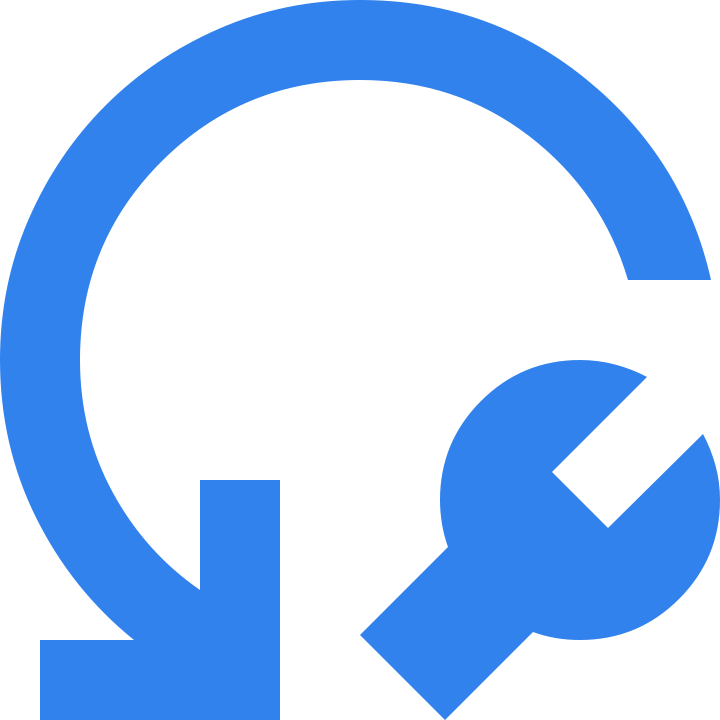

    <h2>
         DDD Toolbox
    </h2>

    <h3>
        A comprehensive collection of Domain-Driven Design tools to help you model complex business domains, facilitate collaborative workshops, and create shared understanding across your organization.
    </h3>
    

        <a href="https://dddtoolbox.com/domain-storytelling">Try Domain Storytelling →</a>
    

## About

DDD Toolbox is a modern web application that provides strategic design tools for Domain-Driven Design practitioners. Whether you're conducting collaborative workshops, mapping domain boundaries, or documenting complex business processes, our tools help bridge the gap between domain experts and development teams.

## Strategic Design Tools

### 🎯 Currently Available

- **[Domain Storytelling](https://dddtoolbox.com/domain-storytelling)** - Visualize and communicate domain knowledge through collaborative storytelling. Create pictorial domain models that bridge the gap between domain experts and development teams.

### 🚀 Coming Soon

- **Event Storming** - Rapidly discover business processes and identify domain boundaries through collaborative workshop techniques. Map out the flow of domain events across your system.

### 📋 Planned

- **Context Mapping** - Define and visualize relationships between bounded contexts. Understand integration patterns and team interactions across different parts of your domain.

- **Bounded Context Canvas** - Document and design your bounded contexts using a structured canvas approach. Capture business model, ubiquitous language, and integration patterns.

- **Aggregate Design Canvas** - Design and document your aggregates using a structured canvas approach. Define aggregate boundaries, invariants, and behavioral patterns.

- **Domain Message Flow** - Model the flow of messages and events between different parts of your system. Visualize how information moves across bounded contexts.
